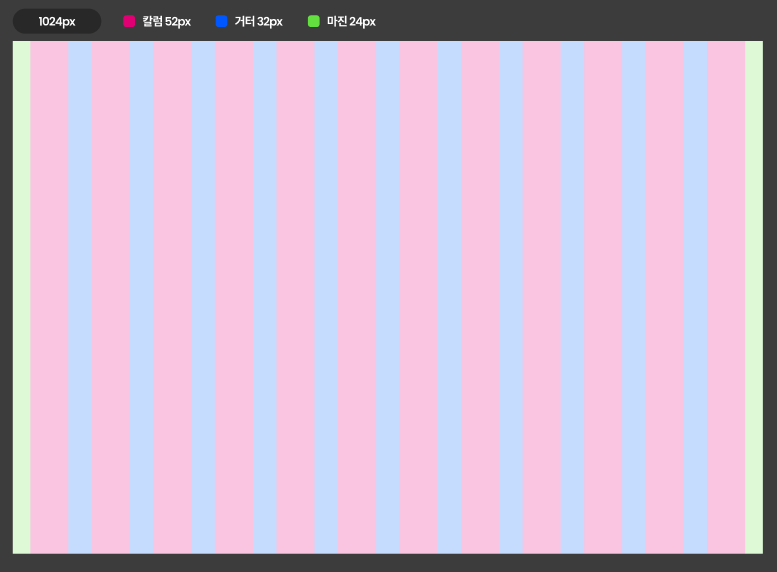
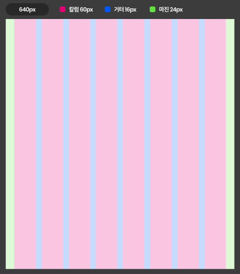
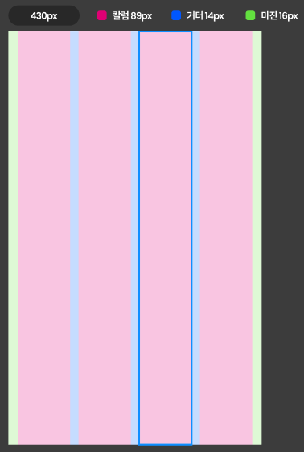

import { Meta } from '@storybook/blocks';

<Meta title="Design System/layouts" />

# Design System - Grid Layout

## Grid Overview

이 디자인 시스템은 다양한 브레이크포인트에 맞춘 특정 마진과 거터 값을 정의한 반응형 그리드 레이아웃입니다.

## Grid at 1024px

- **Margin:** 52px
- **Gutter:** 32px
- **Grid Sections:** 24px

## Grid at 640px

- **Margin:** 60px
- **Gutter:** 16px
- **Grid Sections:** 24px

## Grid at 430px

- **Margin:** 89px
- **Gutter:** 14px
- **Grid Sections:** 16px

